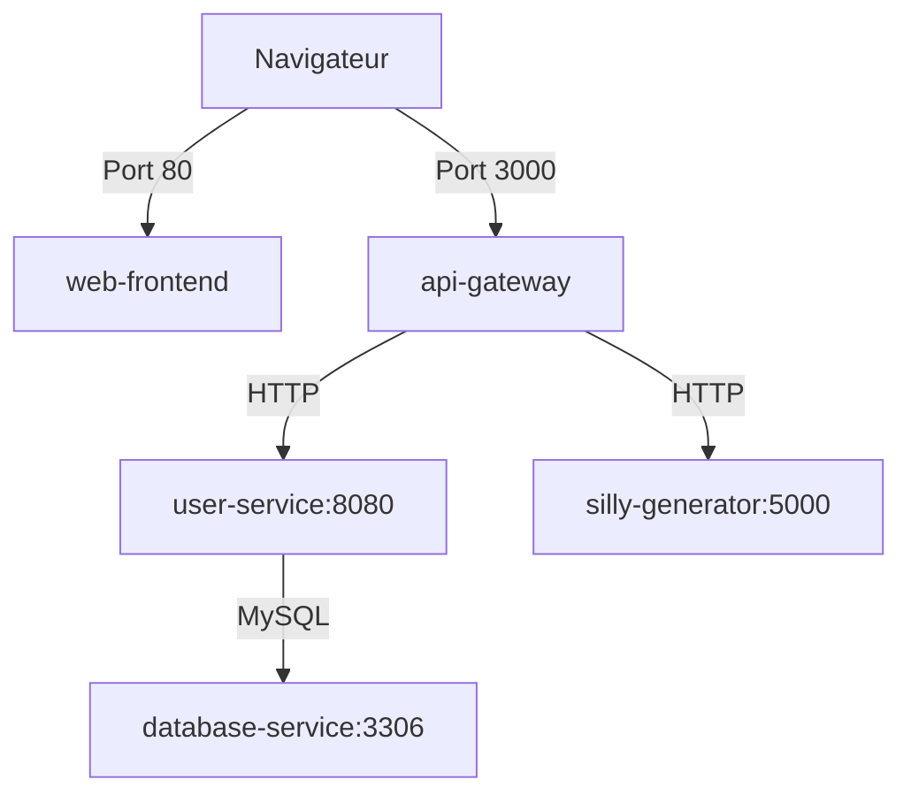

# 🎭 Silly as a Service

> **"Une complexité inutile pour un problème absurde"**

Silly as a Service est une application web complète basée sur une **architecture microservices (4 tiers)**, entièrement conteneurisée avec Docker. Ce projet applique une architecture d'ingénierie sérieuse sur un sujet léger et absurde.

---

## 🏗️ Architecture Technique

L'application est composée de **4 conteneurs distincts** qui communiquent via un réseau Docker interne :

### **TIER 1 : Frontend (web-frontend)**
- **Technologie** : React 18 + Nginx
- **Port exposé** : `80`
- **Rôle** : Interface utilisateur web
- Servi via Nginx pour la production

### **TIER 2 : API Gateway (api-gateway)**
- **Technologie** : Express.js (Node.js)
- **Port exposé** : `3000`
- **Rôle** : Point d'entrée unique, proxy vers les services métier
- Gère le routage des requêtes vers `user-service` et `silly-generator`

### **TIER 3 : Services Métier**

#### **User Service** 
- **Technologie** : Go + MySQL driver
- **Port interne** : `8080` (non exposé à l'extérieur)
- **Rôle** : Gestion des utilisateurs (inscription, connexion)
- Connexion directe à la base de données MySQL

#### **Silly Generator**
- **Technologie** : Python + Flask
- **Port interne** : `5000` (non exposé à l'extérieur)
- **Rôle** : Génération de contenu absurde aléatoire

### **TIER 4 : Persistance (database-service)**
- **Technologie** : MySQL 8.0
- **Port interne** : `3306`
- **Volumes** : Données persistantes avec `db_data`
- Script d'initialisation automatique (`init.sql`)

---

## 📋 Prérequis

- **Docker** (version 20.10+)
- **Docker Compose** (version 2.0+)

---

## 🚀 Installation et Lancement

### 1️⃣ Cloner le projet

```bash
git clone <URL_DU_DEPOT>
cd silly-as-a-service
```

### 2️⃣ Configuration (optionnel)

Copiez le fichier `.env.example` en `.env` et modifiez si nécessaire :

```bash
cp .env.example .env
```

### 3️⃣ Lancer l'application

```bash
docker-compose up --build
```

Cette commande va :
- ✅ Construire tous les conteneurs
- ✅ Créer le réseau Docker interne
- ✅ Initialiser la base de données MySQL
- ✅ Démarrer tous les services

### 4️⃣ Accéder à l'application

- **Frontend** : [http://localhost:80](http://localhost:80) ou [http://localhost](http://localhost)
- **API Gateway** : [http://localhost:3000](http://localhost:3000)

---

## 🔌 Endpoints API

### Via API Gateway (http://localhost:3000)

| Méthode | Endpoint | Description |
|---------|----------|-------------|
| `GET` | `/health` | Healthcheck de l'API Gateway |
| `POST` | `/register` | Inscription d'un utilisateur |
| `POST` | `/login` | Connexion d'un utilisateur |
| `GET` | `/generate` | Génération de contenu absurde |
| `POST` | `/generate` | Génération personnalisée |

### Exemples de requêtes

**Inscription :**
```bash
curl -X POST http://localhost:3000/register \
  -H "Content-Type: application/json" \
  -d '{"username":"test","password":"pass123"}'
```

**Génération de contenu absurde :**
```bash
curl http://localhost:3000/generate
```

---

## 📊 Communication Inter-conteneurs



**Règles importantes** :
- ✅ Seuls `web-frontend` (port 80) et `api-gateway` (port 3000) sont exposés
- ✅ Les services métier (`user-service`, `silly-generator`) ne sont accessibles que via le réseau Docker interne
- ✅ La base de données n'est accessible que par `user-service`

---

## 🗄️ Base de Données

### Structure

**Table `users` :**
```sql
id INT PRIMARY KEY AUTO_INCREMENT
username VARCHAR(50) UNIQUE
password VARCHAR(255)
created_at TIMESTAMP
```

**Table `silly_contents` :**
```sql
id INT PRIMARY KEY AUTO_INCREMENT
content TEXT
user_id INT (FK -> users)
created_at TIMESTAMP
```

### Données de test

Un utilisateur de test est créé automatiquement :
- Username : `test_user`
- Password : `password123`

---

## 🛑 Arrêter l'application

```bash
docker-compose down
```

Pour supprimer également les volumes (⚠️ perte de données) :

```bash
docker-compose down -v
```

---

## 🧪 Tests et Débogage

### Vérifier les logs d'un service

```bash
docker-compose logs api-gateway
docker-compose logs user-service
docker-compose logs silly-generator
docker-compose logs database-service
```

### Accéder à un conteneur

```bash
docker-compose exec api-gateway sh
docker-compose exec user-service sh
docker-compose exec database-service mysql -uroot -pexample silly_db
```

### Rebuild un seul service

```bash
docker-compose up --build api-gateway
```

---

## 📦 Variables d'Environnement

Configurées dans `docker-compose.yml` :

| Variable | Service | Description |
|----------|---------|-------------|
| `USER_SERVICE_URL` | api-gateway | URL du service utilisateur |
| `SILLY_SERVICE_URL` | api-gateway | URL du générateur |
| `DB_HOST` | user-service | Hôte MySQL |
| `DB_USER` | user-service | Utilisateur MySQL |
| `DB_PASSWORD` | user-service | Mot de passe MySQL |
| `DB_NAME` | user-service | Nom de la base |
| `MYSQL_ROOT_PASSWORD` | database-service | Mot de passe root MySQL |

---

## 🎯 Fonctionnalités

- ✅ Architecture microservices complète (4 tiers)
- ✅ Génération de contenu absurde aléatoire
- ✅ Système d'authentification (inscription/connexion)
- ✅ Persistance des données avec MySQL
- ✅ Communication inter-conteneurs sécurisée
- ✅ Frontend React moderne
- ✅ API RESTful avec Express.js
- ✅ Service Go avec connexion MySQL
- ✅ Service Python Flask

---

## 🏆 Points Techniques

### Dockerisation
- ✅ `docker-compose up` fonctionne du 1er coup
- ✅ Dockerfiles optimisés pour chaque service
- ✅ Volumes Docker pour la persistance
- ✅ Réseau Docker interne pour l'isolation

### Architecture
- ✅ 4 tiers bien séparés
- ✅ Séparation Auth (user-service) vs Métier (silly-generator)
- ✅ Communication inter-conteneurs via noms de services
- ✅ Aucun port métier exposé à l'extérieur

### Qualité
- ✅ Application stable sans crash
- ✅ UI/UX fonctionnelle
- ✅ Gestion d'erreurs
- ✅ Logs clairs pour le débogage

---

## 📝 Licence

Ce projet est sous licence MIT.

---

## 👥 Contributeurs

Projet réalisé dans le cadre du module **"De la virtualisation à la conteneurisation"** - EFREI Paris

---

**Version** : 1.0.0  
**Status** : ✅ Production Ready